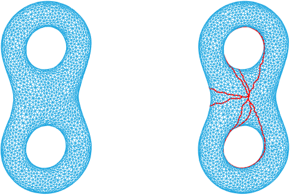
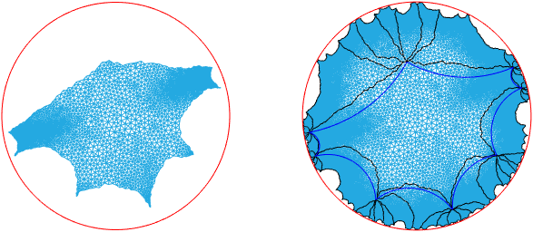

Universal Covering Space
---------------------------
Compute universal covering space for closed surfaces of genus >= 1. Universal covering space is very useful for theoretic argument and algorithm design. Some problems become trivial on universal covering space, such as find geodesic loops. 

## Algorithm Summary:
* compute uniformization metric using Ricci flow
* compute homotopy basis (in fact any cut graph that cuts surface into simplied-connected would be acceptable, but currently only homotopy basis supported)
* slice surface open to obtain base domain
* embed base domain onto Euclidean plane or Poincare disk
* generate universal covering space by gluing copoies of base domain under deck transformation

## Example:
Below is a genus 2 surface and a homotopy basis on it (red loops)

Below left is the base domain embedded onto Poincare disk, right is generated universal covering space.

See demo.m for detailed step to obtain these pictures.

## Dependency:
* [geometry-processing-package][GPP] (download lastest version)
* [export_fig][export_fig] (optional, use to generate fig)

   [GPP]: <https://bitbucket.org/group-gu/geometry-processing-package.git> 
   [export_fig]: <https://github.com/altmany/export_fig.git>